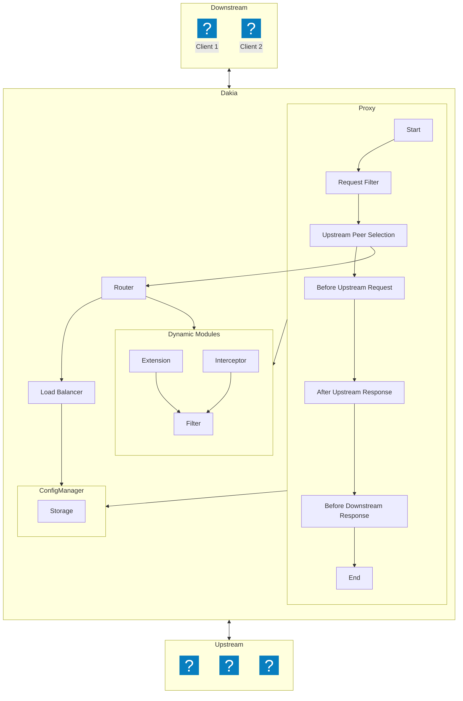

<!--
```text
_______
\  ___ `'.                    .          .--.
 ' |--.\  \                 .'|          |__|
 | |    \  '              .'  |          .--.
 | |     |  '     __     <    |          |  |     __
 | |     |  |  .:--.'.    |   | ____     |  |  .:--.'.
 | |     ' .' / |   \ |   |   | \ .'     |  | / |   \ |
 | |___.' /'  `" __ | |   |   |/  .      |  | `" __ | |
/_______.'/    .'.''| |   |    /\  \     |__|  .'.''| |
\_______|/    / /   | |_  |   |  \  \         / /   | |_
              \ \._,\ '/  '    \  \  \        \ \._,\ '/
               `--'  `"  '------'  '---'       `--'  `"
```
-->

<!-- canva logo url -> https://www.canva.com/design/DAGZAdY1d9c/YCHWZRD78H5j0CAWaaF6gw/edit -->


# Dakia: A cloud native API Gateway
**Dakia** is a cloud native API Gateway designed with developers experience in mind, offering a fully configurable, extensible and programmable network solution. **Dakia** enabling developers to customize and tailor the gateway to fit their unique needs...

> It's under construction 🦺 🪚 🏗️ 🚧 🔨 
>
## Feature highlights

- **Configurable**: Easily manage API configurations using various formats like YAML, JSON, and HTTP API calls.
- **Extensible**: Add new functionality with support for custom middleware and plugins, written in any programming language (Rust, Java, C++, etc.).
- **Fully Programmable**: Tailor the API Gateway to your specific needs with custom plugins and middleware in multiple languages.
- **Zero Downtime Upgrades**: Perform upgrades and restarts without affecting the availability of your services.
- **Dynamic Middleware**: Add, remove, or modify middleware on the fly without disrupting service.
- **Request and Response Management**: Modify requests before they reach the upstream or read/write responses to meet your application's needs.
- **Real-Time Configuration**: Modify your gateway configuration in real time with no downtime, using HTTP API calls.

Dakia ensures your services stay performant, reliable, and highly customizable, giving you full control.

## Limitations ☠️

> These limitations will be addressed over time as we continue to improve the dakia.

- Currently supports only `UTF-8` character encoding.
- Only the round-robin load balancing algorithm is available at the moment.
- IPv6 addresses are not supported at this time; only IPv4 is supported.
- Currently it supports only `HTTP` protocol

## Reasons to use `Dakia`

- **Security** - Built with Rust, Dakia ensures enhanced memory safety and reduces vulnerabilities compared to services written in C/C++.
- **Performance** - Powered by [pingora](https://github.com/cloudflare/pingora), a battle tested protocol implemention, as it has been serving more than **_40M+_** internet requests per second for more than a few years.
- **Customization** - You need ultimate customization, you can configure, extend and even further program in multiple languages.
- **Asynchronous and Multi-Threaded** – Dakia is designed to handle tasks concurrently, ensuring efficient and high-performance request processing by default.

## Architecture



## Getting started

- See our [quick starting guide](/docs/quick_start.md)
- See our [docs](/docs/README.md)

## 📊 Progress Tracker

| Task                                                                                                                      | Status         |
| ------------------------------------------------------------------------------------------------------------------------- | -------------- |
| Configurable(Only yaml supported for now)                                                                                 | Done ✅        |
| Virtual Host                                                                                                              | Done ✅        |
| Wild card host matching ([Wiki](https://en.wikipedia.org/wiki/Matching_wildcards))                                        | Done ✅        |
| Wild card route ([Wiki](https://en.wikipedia.org/wiki/Matching_wildcards))                                                | Done ✅        |
| Proxy                                                                                                                     | Done ✅        |
| HTTP Protocol Suport                                                                                                      | Done ✅        |
| [Upstream SSL support](https://en.wikipedia.org/wiki/Server_Name_Indication)                                              | Done ✅        |
| Load Balancer                                                                                                             | Done ✅        |
| Filter (MongoDB like query support)                                                                                       | Done ✅        |
| Dakia CLI                                                                                                                 | Done ✅        |
| [PCRE](https://www.pcre.org/) support for pattern matching                                                                | Done ✅        |
| Extension, Interceptor & Interceptions Phases (Inbuilt Rust)                                                              | In-Progress 🚀 |
| Extension,Interceptor(Rust,Java, JavaScript)                                                                              | Pending        |
| [UDS Support](https://man7.org/linux/man-pages/man7/unix.7.html)                                                          | Pending        |
| Load Balancer Algoriths (Least connection, Least response time, IP/Url hash, [Service Discovery](http://bakerstreet.io/)) | Pending        |
| SSL Support                                                                                                               | Pending        |
| Certbot Integration                                                                                                       | Pending        |
| Controller (API to manage dakia over REST)                                                                                | Pending        |
| TCP/UDP Proxy                                                                                                             | Pending        |
| Web Socket Proxy                                                                                                          | Pending        |
| gRPC Proxy                                                                                                                | Pending        |
| Docs                                                                                                                      | Pending        |
